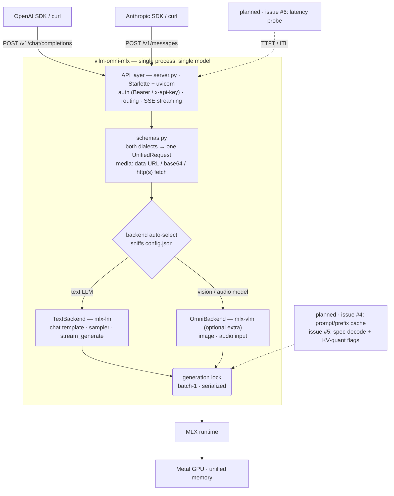

# Architecture

One process, one model, one request at a time — the whole design optimizes for
**batch-1 latency on Apple Silicon** instead of throughput serving.

## Layers

| Layer | File | Responsibility |
| --- | --- | --- |
| API layer | `server.py` | OpenAI and Anthropic dialects over the same core; request auth; SSE streaming (sync generation bridged from a worker thread into the event loop) |
| Normalization | `schemas.py` | One internal `UnifiedRequest` for both APIs; text/image/audio parts; eager media decoding with a 25 MiB remote-fetch cap |
| Backends | `backends.py` | `TextBackend` (mlx-lm) and `OmniBackend` (mlx-vlm); auto-selection by model config; stop-sequence filtering; generation serialized under a lock |
| Runtime | MLX | Model execution on the Metal GPU over unified memory |

## Why it looks like this

- **Batch-1 by design.** A lock serializes generation; concurrent requests queue.
  No scheduler, no continuous batching — the target is one user, lowest latency.
- **Two dialects, one core.** API differences (finish reasons, SSE event shapes,
  media encodings) end at `schemas.py`; backends never know which API called them.
- **Clean backend boundary.** `Backend.chat()` is the only contract. If Python
  orchestration ever becomes the latency wall (plausible only for sub-1B models),
  a Rust frontend over an MLX worker — the system1-omni pattern — can replace the
  layers above the boundary without touching model code.
- **Latency levers live behind the lock.** The planned prompt cache (#4),
  speculative decoding and KV-quantization flags (#5) accelerate the same
  serialized path; the probe harness (#6) measures it.
